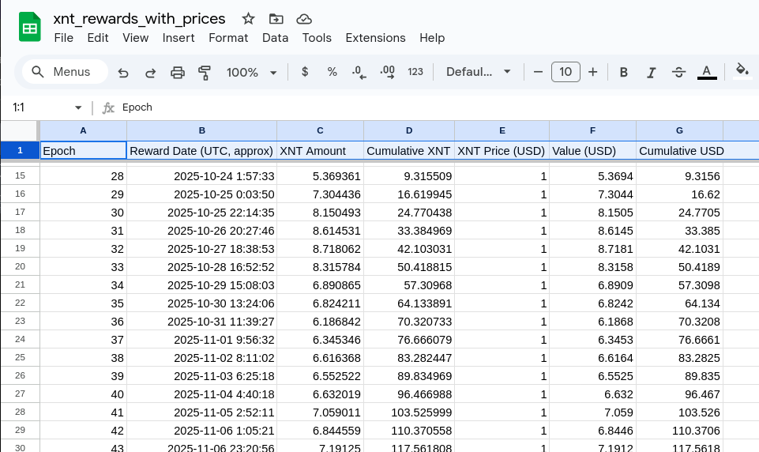
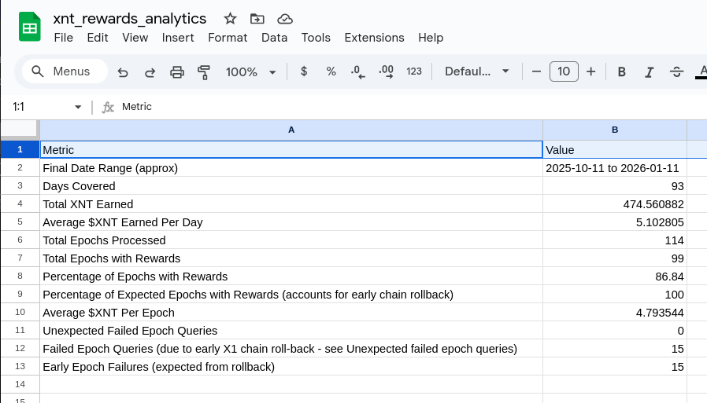

# X1 Blockchain Validator Analytics

## Overview

USE AT YOUR OWN RISK: SEE LICENSE FILE, INCLUDED.

Utilities for reading and summarizing X1 blockchain data about X1 network validators.

### Current Roster of Utilities

- fetch-total-validator-earnings.js

#### Sample Output




## Prerequisites

NodeJS 24.9.x - Earlier versions may work.

## Installation

`npm install`

### Usage

Refer to the module or file header documentation.

## Development

### Test

```bash
cd test
npm run test
```

## Contributing

Fork me on GitHub. :)  Contributions are welcome but note that any contributions are subject to the license as defined in the LICENSE file here.

To be accepted for pull request:

- All tests must pass
- Any major new functionality must have a test runnable from the current approach
- All code must be modular e.g. low cyclomatic complexity ~17 or so.

[](https://github.com/nottoseethesun/x1-validator-analytics/actions/workflows/test.yml)
